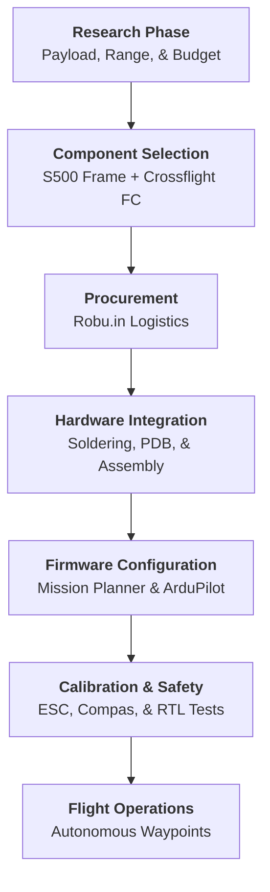
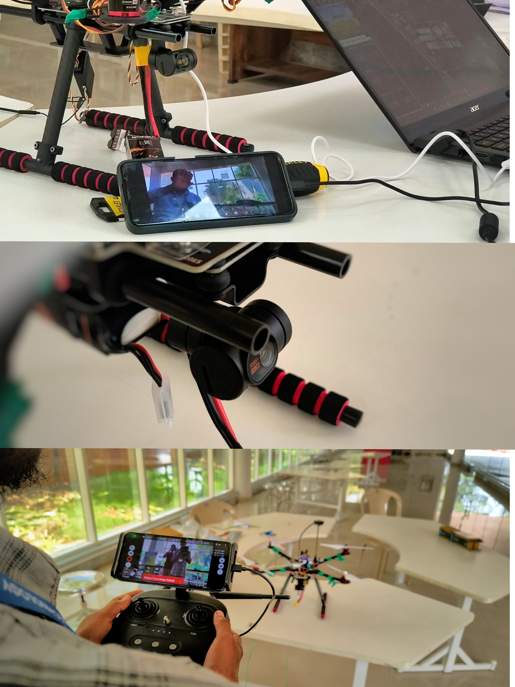

# S500 Autonomous Drone Project: A Comprehensive Beginner's Guide

  

## 🚁 Project Overview

This repository documents the build, configuration, and operation of a custom **S500 Autonomous Drone**. Built on the robust PCB-integrated S500 airframe, this quadcopter is designed for stability and navigational precision.

The primary goal of this project is to demystify autonomous flight systems for beginners, creating a reliable platform for waypoint navigation and aerial imaging using the **Radiolink CrossFlight/Pixhawk** ecosystem.

## 🏗️ System Architecture

### Project Lifecycle Flowchart
This flowchart visualizes the journey from initial research to the first autonomous mission.

---

## 📚 Terminology: The Engineer's Dictionary

> [!TIP]
> Understanding these terms is the first step to becoming a drone pilot!

*   **Pitch, Roll, Yaw**: The three axes of flight. **Pitch** is tilting forward/backward, **Roll** is tilting left/right, and **Yaw** is rotating around the center (spinning).
*   **KV Rating**: Constants for "RPM per Volt". A **920KV** motor spins at 920 RPM for every volt applied. Lower KV = more torque (larger props), Higher KV = more speed (smaller props).
*   **ESC (Electronic Speed Controller)**: The muscle of the drone. It converts DC power from the battery into 3-phase AC pulses to drive the brushless motors. Protocols like **DSHOT** allow faster communication than older PWM signals.
*   **LiPo 'S' Rating**: Stands for "Series". A **3S** battery has 3 cells (11.1V nominal), while a **4S** has 4 cells (14.8V). Higher voltage generally equals more power and efficiency.
*   **RTL (Return to Launch)**: A failsafe mode where the drone uses GPS to automatically fly back to its takeoff point and land.

---

## 🔍 Component Deep-Dive

### Why the S500 Frame?
We selected the **S500 PCB Version** over generic F450 frames for two key reasons:
1.  **Integrated PDB**: The bottom plate of the frame is a Printed Circuit Board (PCB). You solder ESC power wires *directly* to the frame pads. This eliminates the need for a separate Power Distribution Board, reducing weight and failure points.
2.  **Angled Arms**: The upswept arms provide a "dihedral" effect, offering greater stability in flight compared to flat-armed frames.

### The Skydroid T10 Advantage
The **Skydroid T10** is not just a remote; it's a **3-in-1 System**:
*   **RC Control**: Long-range 2.4GHz control links.
*   **Telemetry**: Sends drone health data (Voltage, Altitude, GPS Satellites) back to your phone/tablet.
*   **Video Link**: Integrated video transmission allows you to view the camera feed on the QGroundControl/Skydroid app without extra video transmitters.
*   **Range**: Capable of 10km+ video/data transmission, far exceeding standard hobby radios.

*Buying Source: Obtained from **Robu.in** to ensure genuine parts and reliable shipping logistics.*

---

## 🔧 Mechanical Build Guide

### Motor Orientation
A quadcopter requires two motors to spin **Clockwise (CW)** and two **Counter-Clockwise (CCW)** to cancel out torque.
*   **Silver Cap Motors**: Usually CCW.
*   **Black Cap Motors**: Usually CW.
*   **Critical Step**: Ensure your propellers match the motor direction. A CW prepeller on a CCW motor will not generate lift correctly and may loosen the nut!

### Vibration Dampening
Vibration is the enemy of the Flight Controller (FC).
*   The **Pixhawk/CrossFlight** contains sensitive accelerometers.
*   Always mount the FC using the provided **Anti-vibration Shock Absorber Plate**.
*   **Pro Tip**: Balance your propellers! Unbalanced props are the #1 source of "jello" in video and poor flight performance.

---

## ⚙️ Calibration Checklist

Before the maiden flight, you **MUST** complete these steps in Mission Planner/QGroundControl:

1.  **Accelerometer Calibration**:
    *   Place the drone on a perfectly level surface.
    *   Follow the on-screen prompts to place the drone on its nose, left side, right side, back, and top.
2.  **Compass Calibration**:
    *   **Go Outside!** Never calibrate indoors near wifi routers or metal beams.
    *   Rotate the drone in all axes until the bar hits 100%. This tells the drone where "North" is.
3.  **Radio Calibration**:
    *   ensures the FC knows the min/max range of your sticks and switches.
    *   Set up your **Flight Modes** (Stabilize, Loiter, RTL) on a 3-position switch here.

> [!WARNING]
> **ESC Calibration**: Remove propellers before doing this! This creates the synchronization between your throttle stick and the motor speed.

---

## 📸 Build Gallery

  
  
<em>Fig 1. The fully assembled S500 Quadcopter ready for flight.</em>

| | |
|:---:|:---:|
|  |  |
|  |  |

---

## 📋 Bill of Materials (BOM)

### A. Core Airframe & Propulsion
| Sl. No | Component Name | Qty | Price/Item (₹) | Total (₹) |
| :--- | :--- | :---: | :---: | :---: |
| 1 | S500 SK500 Quadcopter Frame Board PCB Version | 1 | 2,349.00 | 2,349.00 |
| 2 | 2212 920KV Brushless DC Motor for DJI Silver Cap (CCW) | 2 | 685.00 | 1,370.00 |
| 3 | 2212 920KV Brushless DC Motor for DJI Black Cap (CW) | 2 | 639.00 | 1,278.00 |
| 4 | BLHeli_S LITTLEBEE 30A-S OPTO 2-6S LIPO ESC | 4 | 999.00 | 3,996.00 |
| 5 | 9450 Self Locking Propeller For Drone 1CW+1CCW (Original) | 4 | 449.00 | 1,796.00 |

### B. Flight Intelligence & Navigation
| Sl. No | Component Name | Qty | Price/Item (₹) | Total (₹) |
| :--- | :--- | :---: | :---: | :---: |
| 6 | Radiolink CrossFlight Flight Controller | 1 | 5,403.00 | 5,403.00 |
| 7 | Radiolink TS100 Mini GPS | 1 | 3,554.00 | 3,554.00 |
| 8 | Pixhawk 2.4.8 Drone Flight Controller PX4 32 Bit | 1 | 6,299.00 | 6,299.00 |
| 9 | GPS folding metal stand for APM and Pixhawk | 2 | 299.00 | 598.00 |
| 10 | CC3D/APM/Pixhawk Shock Absorber Anti-vibration Plate | 3 | 224.00 | 672.00 |

### C. Remote Control & Video Link
| Sl. No | Component Name | Qty | Price/Item (₹) | Total (₹) |
| :--- | :--- | :---: | :---: | :---: |
| 11 | SKYDROID T10 2.4Ghz 10CH Remote with T10 Receiver | 1 | 12,099.00 | 12,099.00 |
| 12 | SKYDROID TWO AXIS GIMBAL CAMERA for T10/H12 | 1 | 9,999.00 | 9,999.00 |
| 13 | Flysky FS-i6X 2.4GHz 6CH Transmitter with iA10B | 1 | 5,299.00 | 5,299.00 |

### D. Power Management & Charging
| Sl. No | Component Name | Qty | Price/Item (₹) | Total (₹) |
| :--- | :--- | :---: | :---: | :---: |
| 14 | Orange 14.8V 4500mAh 4S 35C Lithium Polymer Battery | 1 | 5,799.00 | 5,799.00 |
| 15 | Orange 11.1V 2200mAh 3S 30C Lipo Battery | 1 | 1,849.00 | 1,849.00 |
| 16 | IMAX B6 AC Lipo Battery Professional Balance Charger | 1 | 2,649.00 | 2,649.00 |
| 17 | Pixhawk APM Power Module with XT60 Connectors | 3 | 629.00 | 1,887.00 |
| 18 | 2s-8s Lipo Battery Voltage Tester / Low Voltage Buzzer | 3 | 129.00 | 387.00 |

### E. Wiring, Connectors & Hardware
| Sl. No | Component Name | Qty | Price/Item (₹) | Total (₹) |
| :--- | :--- | :---: | :---: | :---: |
| 19 | XT60 Male To T Plug Female Adapter | 4 | 199.00 | 796.00 |
| 20 | High Quality 20AWG Silicone Wire 1m - Black | 5 | 49.00 | 245.00 |
| 21 | Heat Shrink Sleeve 3mm Black 1meter | 2 | 13.00 | 26.00 |
| 22 | SafeConnect Twisted 60CM 22AWG Servo Extension | 10 | 69.00 | 690.00 |
| 23 | 5 Pin JST XH 2.54mm Pitch Plug with cable | 10 | 19.00 | 190.00 |
| 24 | M2.5 X 8MM Socket Head Cap Allen Bolt and Nut | 2 | 189.00 | 378.00 |
| 25 | Self Locking Nylon Cable Ties (Black) 100pcs | 3 | 79.00 | 237.00 |

---
**Total Project Cost estimation**: ₹ 68,569.00
